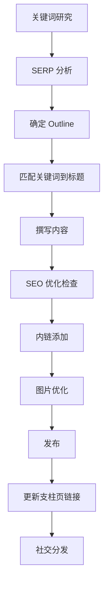

# SOP：内容日历与 Pillar-Cluster 内容模型

## 📋 概述

| 项目 | 说明 |
|------|------|
| 目的 | 系统化管理内容生产，建立主题权威性 |
| 核心模型 | Pillar-Cluster (支柱页-集群页) |
| 发布频率 | 每周 2-3 篇高质量内容 |
| 内容比例 | TOFU:MOFU:BOFU = 40:40:20 |

---

## 🎯 内容漏斗模型

### TOFU / MOFU / BOFU 定义

```
┌─────────────────────────────────────────────┐
│           TOFU (Top of Funnel)              │
│         学习型内容 - Informational           │
│    "什么是369法则" "显化是什么意思"           │
│                40% 内容                      │
├─────────────────────────────────────────────┤
│           MOFU (Middle of Funnel)           │
│         比较型内容 - Commercial              │
│  "369法则 vs 55x5" "最佳显化应用推荐"         │
│                40% 内容                      │
├─────────────────────────────────────────────┤
│           BOFU (Bottom of Funnel)           │
│         购买型内容 - Transactional           │
│    "显化369价格" "显化369注册"               │
│                20% 内容                      │
└─────────────────────────────────────────────┘
```

### AI 时代的内容策略调整

> **重要提示**：在 AI 时代，TOFU 需求会被 LLM 满足，SEO 核心在于 MOFU 和 BOFU。
> 
> 优先针对「商业型和交易型」搜索做内容布局（应对 AI Overviews）

---

## 📚 Topic Cluster 规划

### 显化369 主题集群

#### Cluster 1: 369显化法核心

| 类型 | 页面 | 目标关键词 | 漏斗阶段 | 优先级 |
|------|------|-----------|---------|--------|
| 支柱页 | 369显化法完整指南 | 369显化法, 369法则 | MOFU | 高 |
| 集群页 | 369法则起源与历史 | 特斯拉369, 369起源 | TOFU | 中 |
| 集群页 | 如何正确书写愿望 | 愿望书写, 肯定语 | MOFU | 高 |
| 集群页 | 369法则科学原理 | 神经可塑性, 重复学习 | TOFU | 中 |
| 集群页 | 369法则常见问题 | 369FAQ | TOFU | 低 |
| 集群页 | 369法则 vs 55x5法则 | 369对比, 显化方法对比 | MOFU | 高 |
| 集群页 | 369法则 vs 传统日记 | 显化日记, 369替代品 | MOFU | 高 |

#### Cluster 2: 显化实践

| 类型 | 页面 | 目标关键词 | 漏斗阶段 | 优先级 |
|------|------|-----------|---------|--------|
| 支柱页 | 显化实践完整指南 | 显化方法, 吸引力法则 | MOFU | 高 |
| 集群页 | 早晨显化仪式 | 早晨显化, 显化仪式 | TOFU | 中 |
| 集群页 | 睡前显化技巧 | 睡前显化 | TOFU | 中 |
| 集群页 | 显化冥想指南 | 显化冥想 | TOFU | 中 |
| 集群页 | 提升显化效果的技巧 | 显化技巧, 显化增强 | MOFU | 高 |

#### Cluster 3: 用户场景

| 类型 | 页面 | 目标关键词 | 漏斗阶段 | 优先级 |
|------|------|-----------|---------|--------|
| 支柱页 | 显化成功案例集 | 显化成功, 愿望实现 | MOFU | 高 |
| 集群页 | 职业目标显化 | 职业显化, 升职显化 | MOFU | 高 |
| 集群页 | 财富显化方法 | 财富显化, 金钱显化 | MOFU | 高 |
| 集群页 | 健康显化实践 | 健康显化 | MOFU | 中 |
| 集群页 | 感情显化指南 | 感情显化, 爱情显化 | MOFU | 中 |

---

## 📅 内容日历模板

### 月度内容计划

| 周 | 周一 | 周三 | 周五 |
|---|------|------|------|
| W1 | [TOFU] 博客文章 | [MOFU] 对比页 | - |
| W2 | [MOFU] 用例页 | [TOFU] 博客文章 | [UGC] 用户故事 |
| W3 | [TOFU] 博客文章 | [MOFU] 指南更新 | - |
| W4 | [MOFU] 替代品页 | [TOFU] 博客文章 | [更新] 旧内容刷新 |

### 季度内容规划

| 月份 | 重点主题 | 支柱页 | 集群页数量 | 对比页 | 用例页 |
|------|---------|--------|-----------|--------|--------|
| M1 | 369法则核心 | 1 | 5 | 2 | 1 |
| M2 | 显化实践 | 1 | 4 | 1 | 2 |
| M3 | 用户场景 | 1 | 4 | 1 | 3 |

---

## 📝 内容 Brief 模板

### 博客文章 Brief

```markdown
# 内容 Brief

## 基本信息
- **标题**：[文章标题]
- **URL Slug**：[url-slug]
- **字数目标**：1500-2000 字
- **漏斗阶段**：TOFU / MOFU / BOFU
- **所属 Cluster**：[Cluster 名称]
- **支柱页链接**：[链接到支柱页]

## SEO 信息
- **主关键词**：[1个]
- **次要关键词**：[2-3个]
- **长尾关键词**：[3-5个]
- **Title 标签**：[50-60字符]
- **Meta Description**：[150-160字符]

## 搜索意图分析
- **用户搜索这个词想要什么**：
- **SERP Top 5 内容类型**：
- **内容差距/机会**：

## 内容大纲
### H1: [与 Title 相关但不同]

### H2: [章节1]
- 要点1
- 要点2

### H2: [章节2]
- 要点1
- 要点2

### H2: FAQ（3-5个问题）
- Q1:
- Q2:

## 内链规划
- 链接到支柱页：[锚文本] → [URL]
- 链接到集群页1：[锚文本] → [URL]
- 链接到集群页2：[锚文本] → [URL]

## CTA 规划
- 主 CTA：[顶部]
- 辅助 CTA：[中部]
- 结尾 CTA：[底部]

## 参考资料
- [URL1]
- [URL2]

## 交付要求
- [ ] 文章符合 E-E-A-T 标准
- [ ] 包含真实案例/数据
- [ ] 所有图片有 Alt 文本
- [ ] 内链已添加
- [ ] Schema 标记已准备
```

### 对比页 Brief

```markdown
# 对比页 Brief

## 基本信息
- **标题**：[产品A] vs [产品B]：[年份]详细对比
- **URL**：/blog/[product-a]-vs-[product-b]

## 对比维度
| 维度 | 产品A | 产品B |
|------|-------|-------|
| 价格 | | |
| 核心功能 | | |
| 易用性 | | |
| 用户评价 | | |
| 适合人群 | | |

## 内容结构
1. 快速对比摘要（表格）
2. 产品A 详细介绍
3. 产品B 详细介绍
4. 逐项对比
5. 使用场景推荐
6. 结论与建议

## SEO 优化
- 主关键词：[产品A] vs [产品B]
- 长尾词：[产品A] 替代品, [产品B] 对比
```

---

## 🔄 内容生产流程

### 标准流程



### AI 辅助内容生产流程

1. **找词**
   - 从 Ahrefs/Semrush 找核心关键词 1-3 个
   - 长尾关键词 5-10 个
   - 按动词/名词/形容词/副词分类

2. **确定 Outline**
   - 分析 SERP Top 5-10 文章的 Outline
   - 融合形成更优的新 Outline

3. **匹配关键词**
   - 核心关键词 → Title/H1
   - 长尾关键词 → H2-H5

4. **输入准确信息**
   - 产品品牌词
   - 产品介绍
   - 具体定价
   - 功能截图
   - 操作说明

5. **内容生成**
   - 按区域控制关键词密度
   - Title: 精确包含
   - Heading: 自然包含
   - Features: 功能描述
   - FAQ: 长尾问答
   - CTA: 行动引导

6. **人工审核**
   - 图片插入
   - 内链整理
   - 准确性核实

---

## 📊 内容效果追踪

### 关键指标

| 指标 | 目标 | 监控频率 |
|------|------|---------|
| 有机流量 | 月增 20% | 周度 |
| 关键词排名 | Top 10 占比提升 | 周度 |
| 平均停留时间 | ≥ 2分钟 | 月度 |
| 跳出率 | ≤ 60% | 月度 |
| 转化率 | ≥ 2% | 周度 |

### 内容更新策略

| 内容年龄 | 流量趋势 | 行动 |
|---------|---------|------|
| < 6个月 | 上升 | 维持观察 |
| < 6个月 | 下降 | 分析问题 |
| 6-12个月 | 稳定 | 小幅更新 |
| 6-12个月 | 下降 | 深度更新 |
| > 12个月 | 任何 | 评估重写 |

---

## 📝 交付模板

### 周内容报告

```markdown
# 周内容报告 - W[XX]

## 本周发布
| 标题 | URL | 类型 | 目标关键词 | 发布日期 |
|------|-----|------|-----------|---------|
| | | | | |

## 内容表现（上周发布）
| 标题 | 流量 | 排名变化 | 跳出率 | 备注 |
|------|------|---------|--------|------|
| | | | | |

## 下周计划
| 标题 | 类型 | 负责人 | 截止日期 |
|------|------|--------|---------|
| | | | |

## 待更新内容
| 标题 | 原因 | 优先级 | 计划日期 |
|------|------|--------|---------|
| | | | |
```
