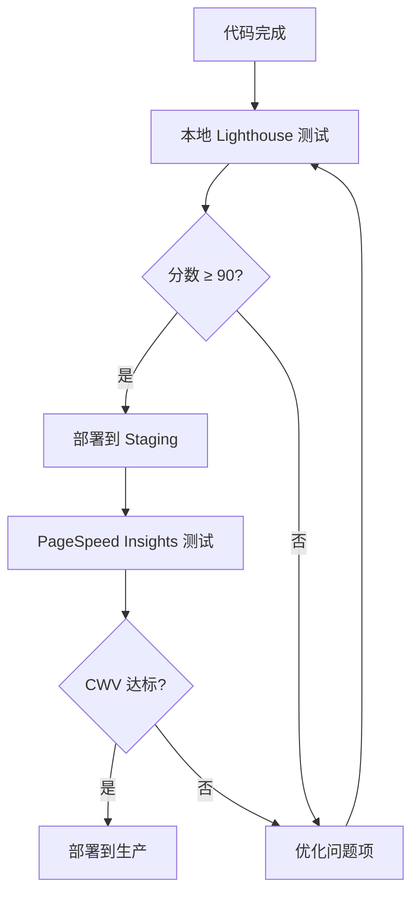

# SOP：Core Web Vitals 优化标准操作流程

## 📋 概述

| 项目 | 说明 |
|------|------|
| 目的 | 确保网站性能达到 Google Core Web Vitals 标准 |
| 核心指标 | LCP ≤ 2.5s, INP ≤ 200ms, CLS ≤ 0.1 |
| 执行频率 | 每次发布前 / 周度监控 |
| 工具 | PageSpeed Insights, Lighthouse, Web Vitals Chrome 扩展 |

---

## 🎯 核心指标详解

### LCP (Largest Contentful Paint) - 最大内容绘制

| 等级 | 时间 | 说明 |
|------|------|------|
| 🟢 良好 | ≤ 2.5s | 用户感知快速 |
| 🟡 需改进 | 2.5s - 4.0s | 可接受但需优化 |
| 🔴 差 | > 4.0s | 严重影响体验 |

**影响因素：**
- 服务器响应时间
- 资源加载时间
- 客户端渲染时间
- 大型图片/视频加载

### INP (Interaction to Next Paint) - 交互到下次绘制

| 等级 | 时间 | 说明 |
|------|------|------|
| 🟢 良好 | ≤ 200ms | 响应迅速 |
| 🟡 需改进 | 200ms - 500ms | 可感知延迟 |
| 🔴 差 | > 500ms | 明显卡顿 |

**影响因素：**
- JavaScript 执行时间
- 主线程阻塞
- 事件处理器复杂度

### CLS (Cumulative Layout Shift) - 累积布局偏移

| 等级 | 分数 | 说明 |
|------|------|------|
| 🟢 良好 | ≤ 0.1 | 布局稳定 |
| 🟡 需改进 | 0.1 - 0.25 | 轻微偏移 |
| 🔴 差 | > 0.25 | 严重偏移 |

**影响因素：**
- 无尺寸的图片/广告
- 动态注入的内容
- 字体加载导致的文本偏移

---

## 🔧 优化策略

### LCP 优化

#### 1. 图片优化

```tsx
// ✅ 使用 WebP 格式和响应式图片
<picture>
  <source srcSet="/images/hero.webp" type="image/webp" />
  
</picture>
```

```tsx
// ✅ 预加载关键资源
// src/components/performance/CriticalResourcePreloader.tsx
<Helmet>
  <link rel="preload" href="/images/hero.webp" as="image" />
  <link rel="preload" href="/fonts/main.woff2" as="font" crossOrigin="anonymous" />
</Helmet>
```

#### 2. 服务器优化

```typescript
// 开启 gzip/brotli 压缩
// 使用 CDN 分发静态资源
// 配置合理的缓存策略
```

#### 3. 代码拆分

```tsx
// ✅ 路由级别代码拆分
const Method369 = lazy(() => import('./pages/Method369'));
const Blog = lazy(() => import('./pages/Blog'));

// ✅ 使用 Suspense 包裹
<Suspense fallback={<PageSkeleton />}>
  <Method369 />
</Suspense>
```

### INP 优化

#### 1. 减少 JavaScript 执行时间

```tsx
// ✅ 使用 useCallback 缓存事件处理器
const handleClick = useCallback(() => {
  // 处理逻辑
}, [dependencies]);

// ✅ 使用 useMemo 缓存计算结果
const expensiveResult = useMemo(() => {
  return computeExpensive(data);
}, [data]);
```

#### 2. 避免主线程阻塞

```tsx
// ✅ 使用 requestIdleCallback 处理非关键任务
requestIdleCallback(() => {
  // 非关键任务
});

// ✅ 使用 Web Worker 处理复杂计算
const worker = new Worker('worker.js');
worker.postMessage(data);
```

#### 3. 优化事件处理

```tsx
// ✅ 使用事件委托
const handleListClick = (e: React.MouseEvent) => {
  const target = e.target as HTMLElement;
  if (target.matches('.list-item')) {
    // 处理点击
  }
};

// ✅ 防抖/节流
const debouncedSearch = useMemo(
  () => debounce(search, 300),
  [search]
);
```

### CLS 优化

#### 1. 为媒体元素指定尺寸

```tsx
// ✅ 始终指定 width 和 height


// ✅ 使用 aspect-ratio
<div className="aspect-video">
  <video src="/video.mp4" />
</div>
```

#### 2. 预留广告/动态内容空间

```tsx
// ✅ 为动态内容预留空间
<div className="min-h-[250px]">
  {adLoaded ? <Ad /> : <AdPlaceholder />}
</div>
```

#### 3. 字体加载优化

```css
/* ✅ 使用 font-display: swap */
@font-face {
  font-family: 'CustomFont';
  src: url('/fonts/custom.woff2') format('woff2');
  font-display: swap;
}
```

```tsx
// ✅ 预加载关键字体
<link 
  rel="preload" 
  href="/fonts/main.woff2" 
  as="font" 
  type="font/woff2"
  crossOrigin="anonymous"
/>
```

---

## 📊 监控与报告

### 实时监控代码

```tsx
// src/hooks/usePerformanceMetrics.ts
import { onLCP, onINP, onCLS } from 'web-vitals';

export const usePerformanceMetrics = () => {
  useEffect(() => {
    onLCP((metric) => {
      console.log('LCP:', metric.value);
      // 发送到分析服务
      sendToAnalytics('LCP', metric.value);
    });

    onINP((metric) => {
      console.log('INP:', metric.value);
      sendToAnalytics('INP', metric.value);
    });

    onCLS((metric) => {
      console.log('CLS:', metric.value);
      sendToAnalytics('CLS', metric.value);
    });
  }, []);
};
```

### 性能预算

| 指标 | 预算 | 警告阈值 | 错误阈值 |
|------|------|---------|---------|
| LCP | 2.0s | 2.5s | 4.0s |
| INP | 150ms | 200ms | 500ms |
| CLS | 0.05 | 0.1 | 0.25 |
| First Contentful Paint | 1.0s | 1.8s | 3.0s |
| Time to Interactive | 3.0s | 5.0s | 7.0s |
| Total Blocking Time | 150ms | 300ms | 600ms |

---

## 🔄 执行流程

### 发布前检查



### 周度监控

1. **收集数据**
   - PageSpeed Insights API 批量检测
   - GSC Core Web Vitals 报告
   - 真实用户监控 (RUM) 数据

2. **分析趋势**
   - 对比上周数据
   - 识别恶化页面
   - 分析根因

3. **优化执行**
   - 按影响排序
   - 修复优先问题
   - 验证效果

---

## 🛠️ 工具清单

| 工具 | 用途 | 类型 |
|------|------|------|
| PageSpeed Insights | 综合性能检测 | 在线 |
| Lighthouse | 详细性能审计 | Chrome DevTools |
| Web Vitals 扩展 | 实时 CWV 监控 | Chrome 扩展 |
| WebPageTest | 深度性能分析 | 在线 |
| Calibre | 持续性能监控 | SaaS |
| SpeedCurve | 竞品性能对比 | SaaS |

---

## 📝 交付模板

### 性能审计报告

```markdown
# Core Web Vitals 审计报告

## 审计信息
- 日期：YYYY-MM-DD
- 测试设备：Mobile / Desktop
- 测试工具：PageSpeed Insights + Lighthouse

## 总体评分
| 指标 | 分数 | 状态 |
|------|------|------|
| Performance | XX | 🟢/🟡/🔴 |
| LCP | X.Xs | 🟢/🟡/🔴 |
| INP | XXms | 🟢/🟡/🔴 |
| CLS | 0.XX | 🟢/🟡/🔴 |

## 页面明细
| 页面 | LCP | INP | CLS | 优先级 |
|------|-----|-----|-----|--------|
| / | | | | |
| /method369 | | | | |

## 优化建议
### 高优先级
1. [问题] - [解决方案]

### 中优先级
1. [问题] - [解决方案]

## 行动计划
| 任务 | 负责人 | 截止日期 | 预期改善 |
|------|--------|---------|---------|
| | | | |
```

### 性能优化 Checklist

- [ ] 图片已压缩为 WebP 格式
- [ ] LCP 图片已预加载
- [ ] 关键 CSS 已内联
- [ ] JavaScript 已代码拆分
- [ ] 字体使用 font-display: swap
- [ ] 所有图片有 width/height
- [ ] 动态内容有预留空间
- [ ] 第三方脚本已延迟加载
- [ ] 已开启浏览器缓存
- [ ] 已使用 CDN
