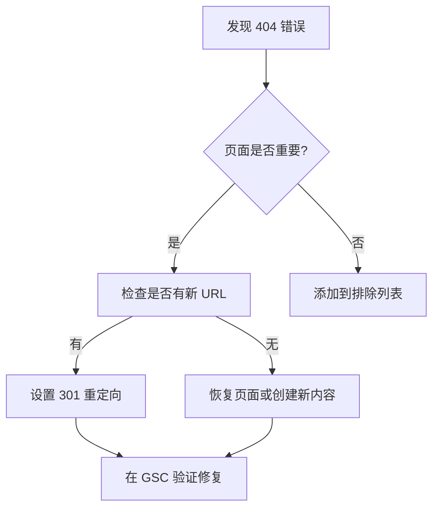

# SOP：Google Search Console 监控标准操作流程

## 📋 概述

| 项目 | 说明 |
|------|------|
| 目的 | 持续监控网站在 Google 搜索中的表现 |
| 核心指标 | 索引状态、404 错误、抓取问题、排名变化 |
| 执行频率 | 每周检查 / 月度深度分析 |
| 工具 | Google Search Console |

---

## 🎯 核心监控维度

### 1. 索引状态

```
关注指标：
- 已索引页面数
- 索引覆盖率
- 索引排除原因
- 新页面索引时间
```

### 2. 抓取状态

```
关注指标：
- 抓取频率
- 抓取错误
- 服务器响应时间
- robots.txt 问题
```

### 3. 性能数据

```
关注指标：
- 总点击量
- 总展示量
- 平均点击率 (CTR)
- 平均排名位置
```

### 4. 增强功能

```
关注指标：
- 结构化数据状态
- 移动端可用性
- Core Web Vitals
- 面包屑导航
```

---

## 📅 周度监控清单

### 每周一执行

```markdown
# GSC 周度检查清单 - [日期]

## 1. 性能概览
- [ ] 检查过去 7 天 vs 前 7 天的变化
  - 点击量变化：____%
  - 展示量变化：____%
  - CTR 变化：____%
  - 平均排名变化：____

## 2. 索引状态
- [ ] 检查索引覆盖率报告
  - 有效页面数：____
  - 警告页面数：____
  - 排除页面数：____
  - 错误页面数：____

## 3. 错误检查
- [ ] 检查 404 错误
  - 新增 404 数量：____
  - 需修复的重要页面：____
  
- [ ] 检查服务器错误 (5xx)
  - 新增 5xx 数量：____
  
- [ ] 检查重定向问题
  - 重定向链：____
  - 无效重定向：____

## 4. 新页面索引
- [ ] 检查最近发布的内容是否已索引
  - 待索引页面：____
  - 需手动请求索引：____

## 5. 异常警报
- [ ] 检查是否有手动操作
- [ ] 检查是否有安全问题
- [ ] 检查是否有重大排名波动

## 6. 行动项
| 问题 | 优先级 | 负责人 | 截止日期 |
|------|--------|--------|---------|
| | | | |
```

---

## 📊 月度深度分析

### 月度报告模板

```markdown
# GSC 月度分析报告 - [月份]

## 执行摘要
[2-3 句话总结本月表现]

## 流量趋势
| 指标 | 本月 | 上月 | 变化 % | 同比 |
|------|------|------|--------|------|
| 总点击量 | | | | |
| 总展示量 | | | | |
| 平均 CTR | | | | |
| 平均排名 | | | | |

## Top 10 表现页面
| 排名 | 页面 | 点击 | 展示 | CTR | 平均排名 |
|------|------|------|------|-----|---------|
| 1 | | | | | |
| 2 | | | | | |
| ... | | | | | |

## Top 10 增长关键词
| 关键词 | 本月点击 | 上月点击 | 增长 % | 当前排名 |
|--------|---------|---------|--------|---------|
| | | | | |

## Top 10 下降关键词
| 关键词 | 本月点击 | 上月点击 | 下降 % | 当前排名 |
|--------|---------|---------|--------|---------|
| | | | | |

## 索引健康度
- 已索引页面：____
- 索引覆盖率：____%
- 新增索引：____
- 从索引中删除：____

## 技术问题
| 问题类型 | 数量 | 趋势 | 优先级 |
|---------|------|------|--------|
| 404 错误 | | ↑/↓/→ | |
| 5xx 错误 | | ↑/↓/→ | |
| 重定向问题 | | ↑/↓/→ | |
| 移动端问题 | | ↑/↓/→ | |

## Core Web Vitals
| 指标 | 良好 % | 需改进 % | 差 % | 趋势 |
|------|--------|---------|------|------|
| LCP | | | | |
| INP | | | | |
| CLS | | | | |

## 结构化数据
| Schema 类型 | 有效项 | 警告 | 错误 |
|------------|--------|------|------|
| Article | | | |
| FAQPage | | | |
| SoftwareApplication | | | |
| BreadcrumbList | | | |

## 优化建议
### 高优先级
1. [建议]
2. [建议]

### 中优先级
1. [建议]
2. [建议]

## 下月目标
| 目标 | 指标 | 目标值 |
|------|------|--------|
| | | |
```

---

## 🔧 常见问题处理

### 404 错误处理流程



### 索引问题处理

| 问题类型 | 原因 | 解决方案 |
|---------|------|---------|
| 已抓取-目前尚未索引 | 内容质量不足 | 提升内容质量，添加更多价值 |
| 已发现-尚未索引 | 抓取预算不足 | 优化内链，提交 sitemap |
| 被 robots.txt 阻止 | 错误配置 | 检查并修正 robots.txt |
| 重复页面-规范标记 | 重复内容 | 设置正确的 canonical |
| 软 404 | 页面返回 200 但无内容 | 修复页面或返回正确状态码 |

### 排名下降诊断

```markdown
## 排名下降诊断清单

### 1. 确认范围
- [ ] 是单个页面还是全站?
- [ ] 是单个关键词还是多个?
- [ ] 下降发生在什么时间?

### 2. 检查技术问题
- [ ] 页面是否可访问?
- [ ] 加载速度是否正常?
- [ ] 移动端是否正常?
- [ ] 有无新的技术错误?

### 3. 检查内容变化
- [ ] 页面内容是否被修改?
- [ ] 标题/描述是否改变?
- [ ] 内链结构是否变化?

### 4. 检查外部因素
- [ ] 是否有算法更新?
- [ ] 竞品是否有新动作?
- [ ] SERP 特性是否变化?

### 5. 检查外链
- [ ] 是否丢失重要外链?
- [ ] 是否有新的低质量外链?

### 结论与行动
[分析结果和解决方案]
```

---

## 📈 关键词追踪

### 关键词分组

| 分组 | 示例关键词 | 当前排名 | 目标排名 | 优先级 |
|------|-----------|---------|---------|--------|
| 品牌词 | 显化369 | #1 | #1 | 维护 |
| 核心词 | 369显化法 | #5 | #3 | 高 |
| 长尾词 | 369法则怎么用 | #12 | Top 10 | 高 |
| 竞争词 | 显化日记app | #25 | Top 10 | 中 |

### 排名机会识别

重点关注排名 #10-25 的关键词：
- 这些关键词有展示但点击少
- 通过优化可以快速进入首页
- 是内链和外链建设的优先目标

---

## 🔔 告警设置

### 设置邮件通知

在 GSC 中设置以下告警：
- [ ] 索引问题通知
- [ ] 安全问题通知
- [ ] 手动操作通知
- [ ] 流量异常通知

### 自定义监控阈值

| 指标 | 警告阈值 | 严重阈值 | 检查频率 |
|------|---------|---------|---------|
| 日点击量下降 | -20% | -50% | 每日 |
| 索引页面减少 | -5% | -20% | 每周 |
| 404 错误增加 | +10 | +50 | 每周 |
| CTR 下降 | -10% | -25% | 每周 |

---

## 📝 交付模板

### 周报模板（简版）

```markdown
# GSC 周报 - W[XX]

## 本周亮点
- ✅ [正面变化]
- ⚠️ [需关注事项]

## 关键指标
| 指标 | 本周 | 上周 | 变化 |
|------|------|------|------|
| 点击 | | | |
| 展示 | | | |
| CTR | | | |
| 排名 | | | |

## 待处理问题
1. [问题1]
2. [问题2]

## 下周重点
1. [计划1]
2. [计划2]
```

### 问题追踪表

| 问题ID | 发现日期 | 问题描述 | 影响页面 | 严重程度 | 状态 | 解决日期 |
|--------|---------|---------|---------|---------|------|---------|
| GSC-001 | | | | | | |
