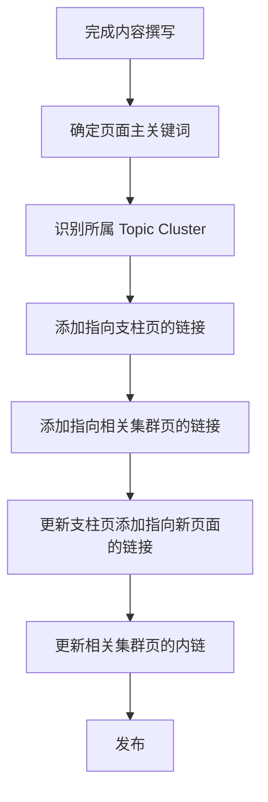

# SOP：内链策略标准操作流程

## 📋 概述

| 项目 | 说明 |
|------|------|
| 目的 | 建立有效的内链网络，提升页面权重传递和用户体验 |
| 核心策略 | Pillar-Cluster 支柱页↔集群页互链模型 |
| 目标指标 | 每页 5-20 个内链 |
| 执行频率 | 新内容发布时 / 月度审计 |

---

## 🎯 内链策略核心原则

### SEO 排名公式中的内链作用

```
核心SEO公式：内容 + 外链 + 技术端 + 用户交互 + (Authority + 内链)
```

> 内链决定了：
> - 页面权重如何在站内流动
> - 爬虫如何发现和理解页面关系
> - 用户如何在站内导航

### Pillar-Cluster 模型

```
                    ┌─────────────┐
                    │   支柱页    │
                    │ (Pillar)   │
                    └─────┬───────┘
                          │
          ┌───────────────┼───────────────┐
          │               │               │
          ▼               ▼               ▼
    ┌──────────┐    ┌──────────┐    ┌──────────┐
    │ 集群页1  │◄──►│ 集群页2  │◄──►│ 集群页3  │
    │(Cluster) │    │(Cluster) │    │(Cluster) │
    └──────────┘    └──────────┘    └──────────┘
```

---

## 📊 显化369 内链架构

### 支柱页 (Pillar Pages)

| 支柱页 | URL | 核心主题 | 目标关键词 |
|--------|-----|---------|-----------|
| 369显化法完整指南 | /method369 | 369方法介绍 | 369显化法, 369法则 |
| 显化实践指南 | /blog/manifestation-guide | 显化方法 | 显化, 吸引力法则 |
| 用户成功案例 | /user-stories | 真实案例 | 显化成功, 愿望实现 |

### 集群页 (Cluster Pages)

| 所属支柱 | 集群页 | URL | 目标关键词 |
|---------|-------|-----|-----------|
| 369显化法 | 369法则起源 | /blog/369-origin | 特斯拉369, 369起源 |
| 369显化法 | 如何正确书写愿望 | /blog/how-to-write-wishes | 愿望书写, 肯定语 |
| 369显化法 | 369法则 vs 55x5 | /blog/369-vs-55x5 | 369对比, 显化方法对比 |
| 显化实践 | 早晨显化仪式 | /blog/morning-ritual | 早晨显化, 显化仪式 |
| 显化实践 | 睡前显化技巧 | /blog/bedtime-manifestation | 睡前显化, 夜间显化 |

---

## 🔗 内链实施规范

### 每页内链数量标准

| 页面类型 | 内链数量 | 说明 |
|---------|---------|------|
| 支柱页 (2000+ 字) | 15-20 个 | 链向所有相关集群页 |
| 集群页 (1000-2000 字) | 8-15 个 | 链向支柱页 + 相关集群页 |
| 博客文章 (500-1000 字) | 5-8 个 | 链向最相关的支柱页和集群页 |
| 产品页 | 5-10 个 | 链向用例页、对比页、FAQ |

### Anchor 文本规范

#### ✅ 推荐

| 类型 | 示例 |
|------|------|
| 精确匹配 (20%) | 「369显化法」 |
| 部分匹配 (30%) | 「了解369法则的科学原理」 |
| 品牌词 (20%) | 「显化369应用」 |
| 自然语言 (30%) | 「查看更多成功案例」 |

#### ❌ 避免

| 类型 | 示例 |
|------|------|
| 通用文本 | 「点击这里」「了解更多」 |
| 过度优化 | 每个链接都用完全相同的锚文本 |
| 无意义链接 | 与上下文无关的链接 |

---

## 📝 内链添加流程

### 新内容发布



### 月度内链审计

1. **导出站点所有页面**
   - 使用 Screaming Frog 或 Ahrefs

2. **分析内链分布**
   - 识别「孤岛页面」（无内链指向）
   - 识别「权重漏洞」（只有出链无入链）

3. **优化优先级**
   - 排名 #10-25 的页面（最需要内链推动）
   - 高价值商业页面
   - 新发布内容

4. **执行优化**
   - 为孤岛页面添加入链
   - 平衡内链分布

---

## 🗂️ 内链矩阵模板

### 页面关系矩阵

| 从 \ 到 | /method369 | /about | /faq | /blog/369-origin | /user-stories |
|---------|------------|--------|------|------------------|---------------|
| /method369 | - | ✅ | ✅ | ✅ | ✅ |
| /about | ✅ | - | ⬜ | ⬜ | ✅ |
| /faq | ✅ | ⬜ | - | ✅ | ⬜ |
| /blog/369-origin | ✅ | ⬜ | ⬜ | - | ⬜ |
| /user-stories | ✅ | ✅ | ⬜ | ⬜ | - |

✅ = 已添加内链  
⬜ = 建议添加  
- = 不需要

---

## 🛠️ 内链代码实现

### React 内链组件示例

```tsx
// src/components/seo/InternalLink.tsx
import { Link } from 'react-router-dom';

interface InternalLinkProps {
  to: string;
  children: React.ReactNode;
  className?: string;
}

export const InternalLink = ({ to, children, className }: InternalLinkProps) => {
  return (
    <Link 
      to={to} 
      className={cn(
        "text-primary hover:text-primary/80 underline underline-offset-4",
        className
      )}
    >
      {children}
    </Link>
  );
};
```

### 内链配置文件

```typescript
// src/config/internalLinks.ts
export const INTERNAL_LINKS = {
  pillarPages: {
    method369: {
      url: '/method369',
      title: '369显化法完整指南',
      description: '了解369显化法的科学原理和使用方法',
      clusters: ['369-origin', '369-how-to', '369-vs-55x5']
    },
    // ...
  },
  clusterPages: {
    '369-origin': {
      url: '/blog/369-origin',
      pillar: 'method369',
      relatedClusters: ['369-how-to']
    },
    // ...
  }
};
```

---

## 📊 内链效果监控

### 关键指标

| 指标 | 目标 | 监控频率 |
|------|------|---------|
| 平均内链数/页 | 8-15 | 月度 |
| 孤岛页面数量 | 0 | 月度 |
| 支柱页入链数 | ≥20 | 月度 |
| 内链点击率 | 提升趋势 | 周度 |

### GSC 报告分析

1. **页面报告** → 查看哪些页面有索引问题
2. **链接报告** → 内部链接 → 识别低内链页面
3. **性能报告** → 分析内链优化后的排名变化

---

## 📝 交付模板

### 内链优化工作表

| 页面URL | 当前入链数 | 当前出链数 | 建议添加入链来源 | 建议添加出链目标 | 锚文本建议 | 优先级 | 状态 |
|---------|-----------|-----------|-----------------|-----------------|-----------|--------|------|
| /method369 | 5 | 12 | /about, /blog/* | /user-stories | 369显化法指南 | 高 | ⬜ |
| /blog/369-origin | 2 | 4 | /method369, /faq | /blog/how-to | 369法则起源 | 高 | ⬜ |

### 内链审计报告模板

```markdown
# 内链审计报告

## 审计日期：YYYY-MM-DD

## 概况
- 总页面数：XX
- 平均内链数：XX
- 孤岛页面数：XX
- 需优化页面数：XX

## 发现问题
1. [问题描述]
2. [问题描述]

## 优化建议
1. [建议描述]
2. [建议描述]

## 执行计划
| 任务 | 负责人 | 截止日期 | 状态 |
|------|--------|---------|------|
| | | | |
```
