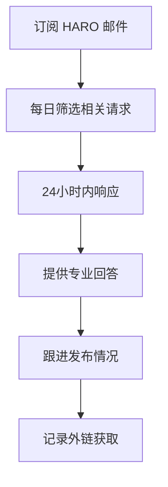

# SOP：外链建设标准操作流程

## 📋 概述

| 项目 | 说明 |
|------|------|
| 目的 | 通过高质量外链提升网站权威性和排名 |
| 核心策略 | HARO + Guest Post + 目录提交 + 品牌提及 |
| 月度目标 | 5次 HARO 回复，目标 DA 40+ 网站 |
| 执行频率 | 每日 HARO / 每周 Guest Post / 月度审计 |

---

## 🎯 外链策略核心

### SEO 排名公式

```
核心SEO公式：内容 + 外链 + 技术端 + 用户交互 + (Authority + 内链)
```

> **关键洞察**：
> - 内容&技术端优化决定你进不进 Top 30
> - 外链决定你进不进 Top 8
> - 交互指标决定你进不进 Top 3

### 外链优先级

优先为排名 #10-25 的关键词页面做外链，这是 ROI 最高的区间。

---

## 📧 HARO (Help A Reporter Out) 策略

### 基本流程



### HARO 回复模板

```markdown
Subject: RE: [Query Topic] - Expert Response from [Your Name]

Hi [Reporter Name],

[直接回答问题的 2-3 句话]

[详细解释，包含具体数据或案例]

[简短总结或独特见解]

---
[Your Name]
[Your Title], [Company Name]
[Website URL]
[Brief Bio: 1-2 sentences about your expertise]
```

### HARO 执行清单

- [ ] 订阅 HARO (helpareporter.com)
- [ ] 设置邮件过滤器筛选相关领域
- [ ] 创建回复模板库
- [ ] 在 24 小时内响应每个相关请求
- [ ] 每月至少 5 次高质量回复
- [ ] 跟踪回复成功率
- [ ] 记录获得的外链

### HARO 回复质量标准

| 要素 | 标准 |
|------|------|
| 响应时间 | ≤ 24 小时 |
| 回复长度 | 150-300 字 |
| 独特价值 | 包含数据/案例/独特见解 |
| 专业性 | 展示领域专业知识 |
| 格式 | 清晰、易读、有结构 |

---

## ✍️ Guest Post 策略

### 目标网站筛选标准

| 标准 | 要求 |
|------|------|
| Domain Authority | ≥ 40 |
| 相关性 | 自我提升/心理健康/生产力/灵性 |
| 流量 | 月访问量 ≥ 10,000 |
| 发布频率 | 活跃更新 |
| 外链政策 | 允许 dofollow 链接 |

### Guest Post Pitch 模板

```markdown
Subject: Guest Post Idea: [Specific Title] for [Website Name]

Hi [Editor Name],

I've been following [Website Name] for a while and loved your recent article on [specific article]. It inspired me to reach out with a guest post idea that I think your readers would find valuable.

**Proposed Topic**: [Title]

**Why This Matters for Your Readers**:
[2-3 sentences on the value proposition]

**Brief Outline**:
1. [Point 1]
2. [Point 2]
3. [Point 3]

**My Background**:
I'm [Your Name], [title/expertise]. I've [relevant credentials/achievements]. My writing has appeared in [publications if any].

Here are some samples of my work:
- [Link 1]
- [Link 2]

Would you be interested in this piece? I'm happy to adjust the angle based on your editorial preferences.

Best,
[Your Name]
[Website/LinkedIn]
```

### Guest Post 流程

1. **研究阶段**
   - 建立目标网站清单（50+）
   - 研究每个网站的内容风格
   - 找到编辑联系方式

2. **Pitch 阶段**
   - 个性化每封 Pitch
   - 提供 2-3 个选题
   - 跟进 7 天后无回复的

3. **撰写阶段**
   - 遵循网站风格指南
   - 自然嵌入 1-2 个外链
   - 提供高质量内容

4. **发布后**
   - 在社交媒体分享
   - 感谢编辑
   - 记录外链

---

## 📂 目录提交策略

### 优先提交平台

| 平台 | 类型 | 优先级 | 链接 |
|------|------|--------|------|
| Product Hunt | 产品发布 | 高 | producthunt.com |
| G2 | 软件评测 | 高 | g2.com |
| Capterra | 软件目录 | 高 | capterra.com |
| GetApp | 软件目录 | 中 | getapp.com |
| AlternativeTo | 替代品目录 | 中 | alternativeto.net |
| SaaSHub | SaaS 目录 | 中 | saashub.com |
| BetaList | 早期产品 | 中 | betalist.com |

### 目录提交清单

```markdown
# 产品目录提交清单

## 基本信息准备
- [ ] 产品名称和 Tagline
- [ ] 产品描述（短版 50 字，长版 200 字）
- [ ] Logo（多种尺寸）
- [ ] 产品截图（5-10 张）
- [ ] 演示视频
- [ ] 定价信息
- [ ] 功能列表

## 提交执行
| 平台 | 提交日期 | 状态 | 获得链接 | 备注 |
|------|---------|------|---------|------|
| Product Hunt | | | | |
| G2 | | | | |
| Capterra | | | | |
```

---

## 🔍 品牌提及监控

### 设置 Google Alerts

```
关键词配置：
- "显化369" -site:369.heymanifestation.com
- "Manifest369" -site:369.heymanifestation.com
- "369显化法" -site:369.heymanifestation.com
- [创始人名字] -site:369.heymanifestation.com
```

### 未链接品牌提及转换

**邮件模板**：

```markdown
Subject: Quick Question About Your Article on [Topic]

Hi [Name],

I came across your article "[Article Title]" and really enjoyed your insights on [specific point].

I noticed you mentioned [our brand/product] in the piece. I wanted to say thanks for the shout-out!

If you think it would add value for your readers, here's a link to [specific resource] that might be helpful: [URL]

Either way, great article!

Best,
[Your Name]
```

---

## 🌐 社区策略

### 目标社区

| 社区 | 平台 | 策略 | 频率 |
|------|------|------|------|
| r/manifestation | Reddit | 价值分享 + 软性提及 | 每周 2-3 次 |
| r/lawofattraction | Reddit | 回答问题 | 每周 2-3 次 |
| 显化相关 Discord | Discord | 社区参与 | 每日 |
| 心理学/自我提升群组 | Facebook | 分享内容 | 每周 1-2 次 |

### 社区参与原则

> **核心策略**：先贡献价值再提及产品

```
80% 纯价值贡献（回答问题、分享经验）
15% 软性品牌提及（在相关讨论中自然提及）
5% 直接推广（在允许的场合）
```

### Reddit 回复模板

```markdown
[直接回答用户问题]

[提供额外价值/个人经验]

[如果相关且自然] 我之前使用 [产品] 时发现...

希望这对你有帮助！
```

---

## 📊 外链监控与报告

### 月度外链报告

```markdown
# 月度外链报告 - [月份]

## 概览
| 指标 | 本月 | 上月 | 变化 |
|------|------|------|------|
| 新增外链数 | | | |
| 平均 DA | | | |
| HARO 成功数 | | | |
| Guest Post 发布数 | | | |

## 新获得外链明细
| 来源网站 | DA | 链接页面 | 锚文本 | 获取方式 | 日期 |
|---------|-----|---------|--------|---------|------|
| | | | | | |

## HARO 活动
| 请求主题 | 回复日期 | 发布状态 | 获得链接 |
|---------|---------|---------|---------|
| | | | |

## 下月计划
| 活动 | 目标 | 负责人 |
|------|------|--------|
| HARO 回复 | 5 次 | |
| Guest Post Pitch | 10 个 | |
| 目录提交 | 3 个 | |
```

### 外链质量审计

每季度执行一次：

1. **导出所有外链**（使用 Ahrefs/Semrush）
2. **检查链接状态**（是否仍然存在）
3. **评估链接质量**（DA、相关性、是否 dofollow）
4. **识别低质量链接**（可能需要否认）
5. **发现新机会**（竞品外链分析）

---

## 📝 交付模板

### 外链建设工作表

| 目标网站 | DA | 联系人 | 邮箱 | Pitch 日期 | 状态 | 跟进日期 | 结果 |
|---------|-----|--------|------|-----------|------|---------|------|
| | | | | | | | |

### 外链效果追踪

| 外链来源 | 目标页面 | 获取日期 | 该页面排名变化 | 流量变化 | ROI 评估 |
|---------|---------|---------|---------------|---------|---------|
| | | | | | |
