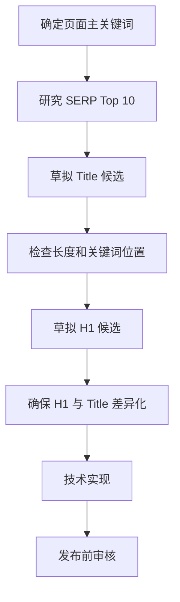

# SOP：Title 标签与 H1 优化标准操作流程

## 📋 概述

| 项目 | 说明 |
|------|------|
| 目的 | 确保每个页面的 Title 和 H1 符合 SEO 最佳实践 |
| 适用范围 | 所有营销页面、博客文章、产品页面 |
| 执行频率 | 新页面创建时 / 季度审计 |
| 负责人 | 内容团队 / SEO专员 |

---

## 🎯 Title 标签规范

### 基本要求

```
长度：50-60 字符（包含空格）
结构：[主关键词] - [价值描述] | [品牌名]
```

### 优化公式

| 页面类型 | Title 模板 | 示例 |
|---------|-----------|------|
| 首页 | [核心关键词] - [价值主张] \| 品牌名 | 369显化法 - 科学的愿望实现方法 \| 显化369 |
| 产品页 | [产品名] - [核心功能/好处] \| 品牌名 | 显化日记 - 每日3分钟愿望书写 \| 显化369 |
| 博客文章 | [文章主题] - [具体内容] \| 品牌名 | 如何使用369法则 - 完整步骤指南 \| 显化369 |
| 对比页 | [产品A] vs [产品B]：[年份]完整对比 | 显化369 vs 传统日记：2024完整对比 |
| 用例页 | [产品] for [用户群体]：[好处] | 显化369 for 创业者：实现目标的科学方法 |

### 检查清单

- [ ] 长度在 50-60 字符之间
- [ ] 主关键词在前 30 字符内
- [ ] 包含品牌名（通常在末尾）
- [ ] 使用分隔符（- 或 |）
- [ ] 与页面内容高度相关
- [ ] 不与其他页面重复
- [ ] 包含行动导向词汇（可选）

---

## 📌 H1 标签规范

### 基本要求

```
数量：每页仅 1 个 H1
内容：包含主关键词，与 Title 意思一致但不完全相同
位置：页面顶部，首屏可见
```

### H1 与 Title 对应示例

| Title | H1 |
|-------|-----|
| 369显化法 - 科学的愿望实现方法 \| 显化369 | 369显化法：让愿望成真的科学方法 |
| 如何使用369法则 - 完整步骤指南 \| 显化369 | 369法则使用指南：从入门到精通 |
| 显化369 vs 传统日记：2024完整对比 | 显化369与传统日记：哪个更适合你？ |

### 检查清单

- [ ] 页面只有 1 个 H1 标签
- [ ] H1 包含页面主关键词
- [ ] H1 与 Title 意思一致但措辞不同
- [ ] H1 在首屏可见
- [ ] H1 清晰描述页面主题
- [ ] H1 对用户有吸引力

---

## 🔄 执行流程

### 新页面创建



### 季度审计

1. **导出所有页面 Title 和 H1**
   ```bash
   # 使用 Screaming Frog 或 GSC 导出
   ```

2. **检查问题**
   - 重复的 Title
   - 过长/过短的 Title
   - 缺失 H1 或多个 H1
   - H1 与 Title 完全相同

3. **优先级排序**
   - 高流量页面优先
   - 排名 #10-25 的页面优先
   - 商业意图页面优先

4. **批量优化**
   - 制作修改清单
   - 按优先级执行
   - 记录修改前后版本

---

## 📊 页面类型 Title/H1 模板库

### 1. 首页

```
Title: 369显化法 - 尼古拉·特斯拉的愿望实现方法 | 显化369
H1: 369显化法：用科学方法实现你的愿望
```

### 2. 功能介绍页

```
Title: [功能名] - [核心价值] | 显化369
H1: [功能名]：[解决什么问题]

示例：
Title: 智能提醒 - 永不错过显化时间 | 显化369
H1: 智能提醒系统：让显化成为每日习惯
```

### 3. 博客文章

```
Title: [主题]：[具体内容] [年份] | 显化369
H1: [主题]：[扩展描述]

示例：
Title: 369显化法原理：神经科学解释 2024 | 显化369
H1: 369显化法的科学原理：为什么重复书写如此有效
```

### 4. FAQ 页面

```
Title: [主题] 常见问题 - [数量]个问答 | 显化369
H1: [主题]常见问题解答

示例：
Title: 369显化法常见问题 - 完整FAQ指南 | 显化369
H1: 369显化法：你最关心的问题解答
```

### 5. 对比页

```
Title: [产品A] vs [产品B]：[年份]详细对比 | 显化369
H1: [产品A] vs [产品B]：哪个更适合你？
```

### 6. 替代品页

```
Title: [年份] [竞品] 替代品 - Top [数量] 推荐 | 显化369
H1: 最佳 [竞品] 替代品：为什么选择显化369
```

### 7. 用例页

```
Title: [产品] for [用户群体] - [核心价值] | 显化369
H1: [用户群体]如何使用[产品]实现[目标]
```

---

## ⚠️ 常见错误

| 错误类型 | 错误示例 | 正确示例 |
|---------|---------|---------|
| Title 过长 | 369显化法完整指南 - 如何使用尼古拉·特斯拉的神奇显化方法来实现你的所有愿望 \| 显化369 | 369显化法 - 完整使用指南 \| 显化369 |
| 关键词堆砌 | 369显化法,显化方法,愿望实现,吸引力法则 | 369显化法 - 科学的愿望实现方法 |
| H1 与 Title 相同 | 两者都是：369显化法 - 科学方法 | Title: 369显化法 - 科学方法 / H1: 369显化法：让愿望成真 |
| 多个 H1 | 页面有 2-3 个 H1 标签 | 页面只有 1 个 H1 标签 |
| H1 无关键词 | 欢迎来到我们的网站 | 369显化法：开启你的显化之旅 |

---

## 🛠️ 工具推荐

| 工具 | 用途 | 链接 |
|------|------|------|
| Screaming Frog | 批量检查 Title/H1 | screaming frog.co.uk |
| Ahrefs | 关键词研究 | ahrefs.com |
| Google Search Console | 点击率分析 | search.google.com/search-console |
| SERP Simulator | Title 预览 | mangools.com/free-seo-tools/serp-simulator |

---

## 📝 交付模板

### Title/H1 优化工作表

| 页面URL | 当前Title | 当前H1 | 新Title | 新H1 | 主关键词 | 优先级 | 状态 |
|---------|----------|--------|---------|------|---------|--------|------|
| /about | 关于我们 | 关于我们 | 关于显化369 - 创始人故事 \| 显化369 | 关于显化369：从怀疑者到显化实践者 | 关于显化369 | 高 | ⬜ |
| /method369 | 369方法 | 什么是369 | 369显化法 - 尼古拉·特斯拉的神奇方法 \| 显化369 | 369显化法：特斯拉推崇的宇宙密码 | 369显化法 | 高 | ⬜ |
